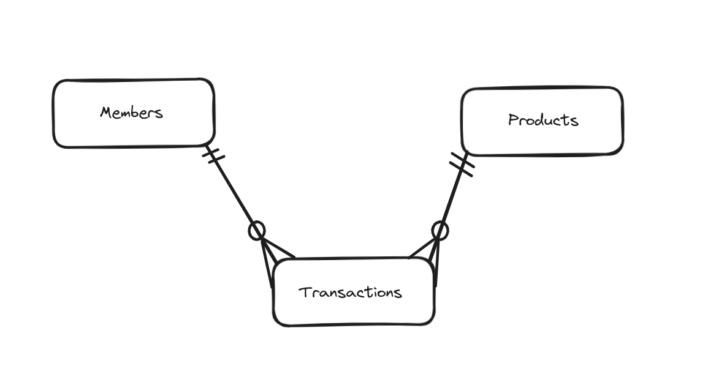

# COLONY-DB 
A Database solution for shop transactions in a housing society

By Nafis Bin Nizam Fahim

Video overview: <https://www.youtube.com/watch?v=PSyDKsFDlWM>

## Scope

This database for CS50 SQL includes all entities necessary to facilitate the process for tracking people living in a colony. As such, included in the database's scope is:

It also allows to analyze the data for people's consumption which can help companies make better choices for launching and distribution of products.

* Members, including the basic indentifying information
* products, including the basic indentifying information
* transactions, including the date and time at which transaction was made, the product and member to which transaction is related to, the amount of transaction, and the quantity of products

## Functional Requirements

This database will support:

* CRUD operations for members, products
* Tracking multiple transaction for the same combination of member and product which is someone buying the same product twice

## Representation

Entities are captured in SQLite tables with the following schema.

### Entities

The database includes the following entities:

#### Members

The `members` table includes:

* `id`, which specifies the unique ID for the member as an `INTEGER`. This column thus has the `PRIMARY KEY` constraint applied.
* `name`, which specifies member's name as an `TEXT`.
This column thus has the `UNIQUE` constraint applied which ensures no two member have the same name

#### Products

The `products` table includes:

* `id`, which specifies the unique ID for the member as an `INTEGER`. This column thus has the `PRIMARY KEY` constraint applied.
* `name`, which specifies product's name as an `TEXT`.
This column thus has the `UNIQUE` constraint applied which ensures no two product have the same name
* `catagory`, which specifies what catagory a product belongs to as a TEXT. Here, there is a `CHECK` constraint to ensure each product must be in certain fixed catagories.
* `price`, which specifies price of a product as `NUMERIC`,
This column has a `CHECK` constraint which checks the price of a 
product must be greater than 0.
* `quantity`, which specifies the volume of available products as `INTEGER`. This column has the `CHECK` constraint to ensure quantity is never negative.

#### Transactions

The `transactions` table includes:

* `id`, which specifies the unique ID for the member as an `INTEGER`. This column thus has the `PRIMARY KEY` constraint applied.
* `product_id`, which specifies the ID of the product on which the transaction was made as an `INTEGER`. This column thus has the `FOREIGN KEY` constraint applied, refering the `id` column in the `products` table
* `member_id`, which specifies the ID of the member of whom made the transaction as an `INTEGER`. This column thus has the `FOREIGN KEY` constraint applied, refering the `id` column in the `members` table
* `quantity`, which specifies the volume products bought as `INTEGER`. This column has the `CHECK` constraint to ensure quantity is always greater than 0.
* `amount`, which specifies amount of a transaction as `NUMERIC`,
This column has a `CHECK` constraint which checks the transaction amount must be greater than 0.
* `datetime`, which specifies date and time at which transaction was made as `NUMERIC`. This column has the `DEFAULT` value of `CURRENT_TIMESTAMP`

### Relationships

The below entity relationship diagram describes the relationships among the entities in the database.

As detailed in the diagram:

* One member can make zero to many transactions. 0, if they never bought a product, and many if they buy more than one product. A transaction is made by one and only one member.
* One product can have zero to many transaction. 0, if the product is never bought by any member, and many if this product was bought multiple times. A transaction is associated with one product only.

## Optimizations

Per the typical queries in `queries.sql`, it is common for users of the database to access name of members. For that reason, indexes are created on the `name` column of members to speed up the queries.

Similarly, it is also convinient to see which members are spending more money in consumption. Therefore, a view named `wealthy` is created which shows top 3 members with highest spenditure.
